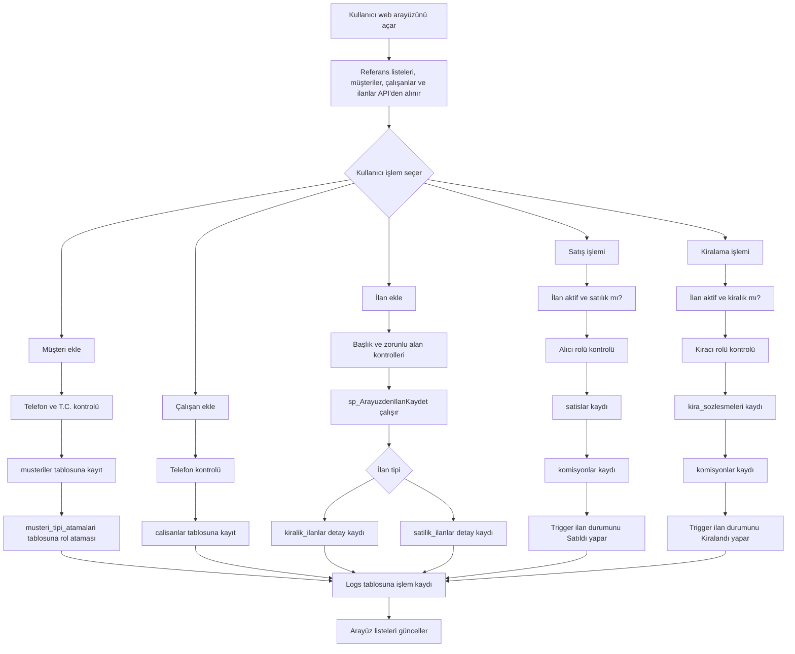
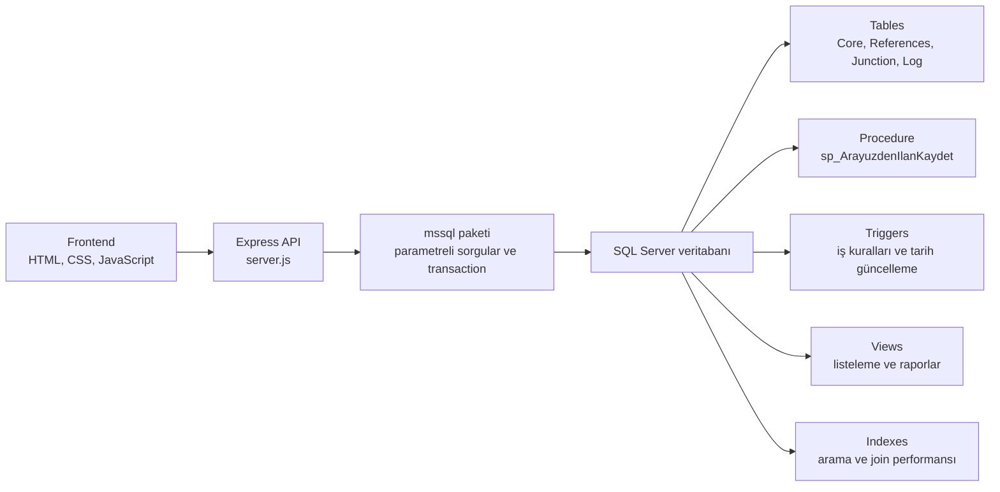
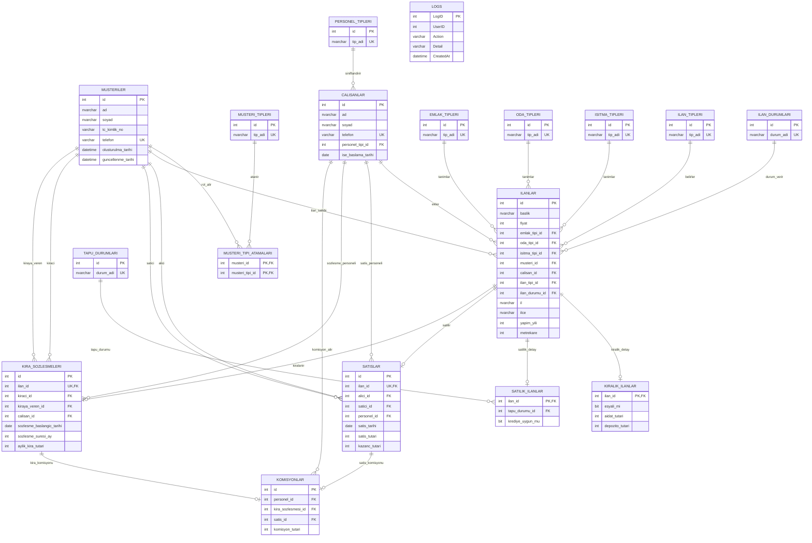

# Emlakçı Otomasyonu Proje Raporu

Bu doküman, emlakçı otomasyonu projesinin problem tanımını, araştırma sürecini, işlem akışlarını, yazılım mimarisini, veritabanı modelini ve genel yapısını özetleyen proje raporudur.

## Problem Tanımı

Emlak ofislerinde müşteri, çalışan, ilan, satış, kiralama ve komisyon bilgilerinin ayrı dosyalarla veya elle takip edilmesi veri tekrarına, işlem hatalarına ve raporlama zorluğuna neden olur. Projenin temel problemi, bir emlak işletmesinin günlük kayıt ve işlem süreçlerini tek bir veritabanı üzerinde düzenli, sorgulanabilir ve kontrollü hale getirmektir.

Bu kapsamda sistemin çözmesi beklenen ana ihtiyaçlar şunlardır:

- Müşterilerin kimlik, telefon ve rol bilgilerinin tutulması.
- Çalışanların personel tipi ve iletişim bilgilerinin kaydedilmesi.
- Satılık ve kiralık ilanların ortak ilan bilgileriyle birlikte ayrı detay tablolarında saklanması.
- Satış ve kiralama işlemlerinde müşteri rollerinin, ilan tipinin ve ilan durumunun tutarlı kalması.
- Satış/kiralama sonrası komisyon kayıtlarının personelle ilişkilendirilmesi.
- Listeleme, arama ve özet rapor ekranlarıyla verilerin web arayüzünden görüntülenmesi.
- Hatalı veya mükerrer işlem risklerinin veritabanı kuralları, transaction kullanımı ve uygulama kontrolleriyle azaltılması [1][3][6][7].

## Yapılan Araştırmalar

Proje geliştirme sürecinde öncelik, verinin tutarlı kalması ve web arayüzünden yapılan işlemlerin veritabanı modeliyle uyumlu olması üzerine kurulmuştur.

İlişkisel veri modeli için SQL Server foreign key, primary key, unique index ve check constraint kullanımı incelenmiştir. Bu araştırma sonucunda müşteri, çalışan, ilan, satış, kira sözleşmesi ve komisyon tabloları arasında foreign key ilişkileri kurulmuş; telefon gibi alanlarda benzersizlik, tutar ve tarih gibi alanlarda check kuralları uygulanmıştır [1].

Referans verilerinin tekrar tekrar çalıştırıldığında mükerrer kayıt üretmemesi için `INSERT` yerine SQL Server `MERGE` yaklaşımı kullanılmıştır. Böylece personel tipi, müşteri tipi, ilan tipi, ilan durumu, tapu durumu, emlak tipi, oda tipi ve ısıtma tipi listeleri idempotent biçimde yüklenebilir hale getirilmiştir [2].

Satılık/kiralık ilan ayrımının yalnızca arayüzde değil veritabanında da korunması için trigger kullanımı araştırılmıştır. Trigger yapısı ile ilan tipi kontrolü, müşteri rolü kontrolü, işlem sonrası ilan durumunun güncellenmesi ve `guncellenme_tarihi` alanlarının otomatik yenilenmesi sağlanmıştır [3].

İlan ekleme işlemi birden fazla tabloyu etkilediği için stored procedure yapısı tercih edilmiştir. `sp_ArayuzdenIlanKaydet` prosedürü önce `ilanlar` tablosuna ana ilan kaydını ekler, ardından ilan tipine göre `kiralik_ilanlar` veya `satilik_ilanlar` detay tablosuna kayıt açar. Bu yapı, ilan kaydının tek bir kontrollü işlem olarak yürütülmesini sağlar [4].

Listeleme ve raporlama ekranlarında karmaşık join sorgularını sadeleştirmek için SQL Server view yapısı kullanılmıştır. Satılık ilanlar, kiralık ilanlar ve personel komisyon özetleri view dosyaları üzerinden okunur [5].

Web uygulaması tarafında Express.js ile REST benzeri API rotaları hazırlanmıştır. `GET` rotaları listeleme ve raporlama için; `POST`, `PUT` ve `DELETE` rotaları ise kayıt oluşturma, güncelleme ve silme işlemleri için kullanılmıştır [6].

Node.js ile SQL Server bağlantısı için `mssql` paketi kullanılmıştır. Uygulamada connection pool, parametreli sorgular ve transaction yapıları kullanılarak bağlantı yönetimi ve veri yazma işlemleri daha kontrollü hale getirilmiştir [7].

Proje raporundaki akış ve veritabanı diyagramları için Mermaid tercih edilmiştir. Bu sayede diyagramlar README içinde metin tabanlı ve düzenlenebilir şekilde tutulmuştur [8].

## Akış Şeması

Aşağıdaki şema, sistemdeki temel kullanıcı işlemlerinin genel akışını göstermektedir.



## Yazılım Mimarisi

Proje üç ana katmandan oluşur:

- Arayüz katmanı: `WebApp/public/index.html`, `styles.css` ve `app.js` dosyaları kullanıcı ekranlarını, formları, tabloları, arama/sıralama işlemlerini ve API çağrılarını yönetir.
- API katmanı: `WebApp/server.js` Express uygulamasını, HTTP rotalarını, validation kontrollerini, transaction kullanımını, hata yönetimini ve statik dosya servis etmeyi içerir.
- Veritabanı katmanı: `database` klasörü SQL Server tablolarını, referans verilerini, triggerları, viewları, indexleri ve stored procedure dosyasını içerir.



Geliştirme aşamaları şu sırayla ele alınmıştır:

1. İş alanı analizi yapılarak müşteri, çalışan, ilan, satış, kiralama ve komisyon varlıkları belirlenmiştir.
2. Referans tabloları ve çekirdek tablolar oluşturulmuştur.
3. Foreign key, unique, check ve filtered unique index kuralları eklenmiştir.
4. Referans verileri `MERGE` komutları ile seed edilmiştir.
5. Satılık/kiralık ilan tutarlılığı ve müşteri rol kontrolleri triggerlarla desteklenmiştir.
6. İlan ekleme işlemi stored procedure ile merkezi hale getirilmiştir.
7. Satılık/kiralık ilan ve komisyon raporları view dosyalarıyla hazırlanmıştır.
8. Express API rotaları ve web arayüzü veritabanı işlemlerine bağlanmıştır.
9. Başarılı işlemler ve hatalar için loglama yapısı eklenmiştir.

## Veri Tabanı Diyagramı

Aşağıdaki ER diyagramı, ana tablolar ve ilişkileri özetler.



## Genel Yapı

Proje SQL Server hedefli bir emlakçı otomasyonudur. Veritabanı dosyaları T-SQL özellikleri kullanır; bu nedenle PostgreSQL veya MySQL üzerinde doğrudan çalışacak biçimde tasarlanmamıştır.

Klasör yapısı:

```text
emlakci-otomasyonu-db/
├── database/
│   ├── Tables/
│   │   ├── Core/
│   │   ├── References/
│   │   ├── Junction/
│   │   └── Log/
│   ├── Seed/
│   ├── Triggers/
│   ├── Views/
│   ├── Indexes/
│   └── Procedures/
└── WebApp/
    ├── server.js
    ├── logger.js
    ├── public/
    │   ├── index.html
    │   ├── styles.css
    │   └── app.js
    └── package.json
```

Sistemdeki temel modüller:

- Müşteri yönetimi: Müşteri ekleme, müşteri tipleri atama, telefon ve T.C. kontrolü.
- Çalışan yönetimi: Çalışan ekleme, personel tipi ilişkisi ve telefon kontrolü.
- İlan yönetimi: Satılık/kiralık ilan ekleme, düzenleme, silme ve detay görüntüleme.
- Satış yönetimi: Aktif satılık ilanı satma, alıcı rolü kontrolü, satış ve komisyon kaydı.
- Kiralama yönetimi: Aktif kiralık ilanı kiralama, kiracı rolü kontrolü, kira sözleşmesi ve komisyon kaydı.
- Raporlama: Satılık ilanlar, kiralık ilanlar, satış geçmişi, kira sözleşmeleri ve personel komisyon özeti.
- Loglama: Başarılı işlemler ve hata durumlarında `Logs` tablosuna kayıt yazma.

Veritabanı kurulumunda önerilen sıra:

1. `database/Tables/References` altındaki referans tabloları.
2. `database/Tables/Core` altındaki çekirdek tablolar.
3. `database/Tables/Junction` ve `database/Tables/Log` tabloları.
4. `database/Seed/referans_verileri.sql`.
5. `database/Indexes/indexes.sql.sql`.
6. `database/Triggers` dosyaları.
7. `database/Views` dosyaları.
8. `database/Procedures/pdr_satilik_ve_kiralik_ilanlar_auto.sql`.

Web uygulamasını çalıştırmak için `WebApp` klasöründe `.env` dosyasına SQL Server bağlantı bilgileri girilir ve ardından aşağıdaki komutlar çalıştırılır:

```bash
npm install
npm start
```

Varsayılan adres:

```text
http://localhost:3000
```

## Referanslar

[1] Microsoft Learn, "Primary and foreign key constraints - SQL Server". Erişim tarihi: 05.06.2026. https://learn.microsoft.com/en-us/sql/relational-databases/tables/primary-and-foreign-key-constraints

[2] Microsoft Learn, "MERGE (Transact-SQL) - SQL Server". Erişim tarihi: 05.06.2026. https://learn.microsoft.com/en-us/sql/t-sql/statements/merge-transact-sql

[3] Microsoft Learn, "CREATE TRIGGER (Transact-SQL) - SQL Server". Erişim tarihi: 05.06.2026. https://learn.microsoft.com/en-us/sql/t-sql/statements/create-trigger-transact-sql

[4] Microsoft Learn, "CREATE PROCEDURE (Transact-SQL) - SQL Server". Erişim tarihi: 05.06.2026. https://learn.microsoft.com/en-us/sql/t-sql/statements/create-procedure-transact-sql

[5] Microsoft Learn, "CREATE VIEW (Transact-SQL) - SQL Server". Erişim tarihi: 05.06.2026. https://learn.microsoft.com/en-us/sql/t-sql/statements/create-view-transact-sql

[6] Express.js Documentation, "Routing". Erişim tarihi: 05.06.2026. https://expressjs.com/en/guide/routing/

[7] tediousjs/node-mssql Documentation, "Microsoft SQL Server client for Node.js". Erişim tarihi: 05.06.2026. https://github.com/tediousjs/node-mssql

[8] Mermaid Documentation, "Entity Relationship Diagrams". Erişim tarihi: 05.06.2026. https://mermaid.js.org/syntax/entityRelationshipDiagram.html
